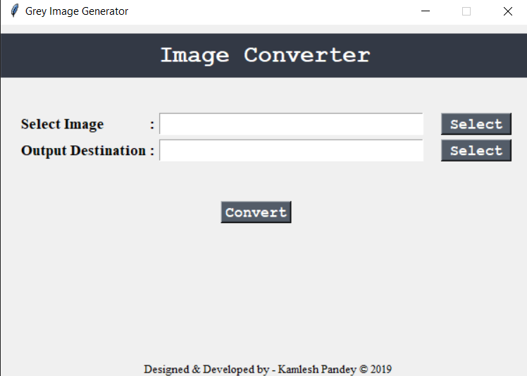

# Word-Cloud-Generator
  Gray Image Generator in Python 3 with Tkinter UI.
  
# Requirements
  - Cv2 Library.
  
# Usage 
  - Clone or Download this Repository.
  - Enter the Location to Select Image.
  - Enter your output destination to save image.
  - Click on Convert.
  
# Credits
  
  - Created by Kamlesh Pandey. 
  
  
# Screenshots  
  
